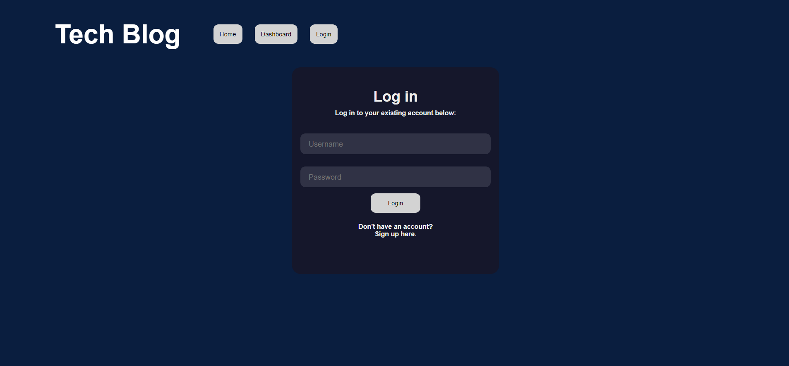
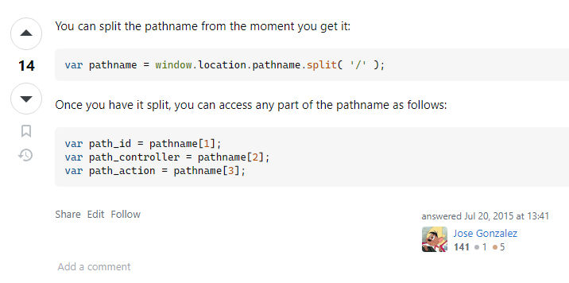

# 14-Challenge-Tech-Blog

        
## Description
            
This project is a full-stack Tech Blog application which follows the MVC (Model–view–controller) paradigm in its architectural structure. It uses Handlebars.js as the templating language, Sequelize as the ORM, and the express-session npm package for authentication.

I built this application as a platform for people to discuss technology in a 'blog' style format. The collaborative nature of the application allows uses to engage in multiple threads of discussion which creates a community feeling. 

By completing this project, I now understand how to create a full stack application from scratch which has increased my confidence and expertise for other projects going forward. 

### Demonstration:

#### Video walkthrough:
To view a live demonstration of how the application works, [please watch this video](https://drive.google.com/file/d/1c32w35f-MP1BgwWfcTk4s8tSBrYJLgwf/view) which goes through the steps of signing up and adding, editing and deleting a post. 

#### Screenshots

- The application's home page with one example blog post:

- The log in form (the sign up form is identical and accessed by clicking the link at the bottom):

- Adding a comment to a post (only if the user is logged in):

            
## Table of Contents
            
- [Installation](#installation)
- [Usage](#usage)
- [License](#license)
- [Contributing](#contributing)
- [Tests](#tests)
- [Questions](#questions)
            
## Installation

To install this application, you'll need to clone the repository to your local machine. [Refer to this guide from GitHub if you need help.](https://docs.github.com/en/repositories/creating-and-managing-repositories/cloning-a-repository/)

Once cloned, you will need to navigate to the project's folder in your terminal and run the following command to install the necessary dependencies: `npm install`.

Next, you will need PostgreSQL installed on your computer to initialise the database. [Visit PostgreSQL's website for links to download and installation instructions.](https://www.postgresql.org/)

            
## Usage

If you would like to host the application locally, follow the steps below:

Once all of the steps in [Installation](#installation) have been completed, you will firstly need to initialise the 'blog_db' database and seed data into it. To do so, enter the following commands once navigated to the project folder in your terminal:

1. `psql -U postgres` - This will start PostgreSQL. Enter your password if you set one up. 
2. `\i db/schema.sql` - To set up the 'employee_db' database. 
3. Close out of postgres by entering `Control + c`.

Next, seed the data by entering the following once navigated to the project folder in your terminal:

4. `node seeds/seed.js`

Then, you can run the server locally by entering the following:

5. `node server.js`.

6. If everything was installed and run correctly, you should be able to visit the application hosted locally on your machine by visiting: http://localhost:3001/
            
## License
            
MIT License

Copyright (c) 2024 isaacfallon
            
Permission is hereby granted, free of charge, to any person obtaining a copy
of this software and associated documentation files (the "Software"), to deal
in the Software without restriction, including without limitation the rights
to use, copy, modify, merge, publish, distribute, sublicense, and/or sell
copies of the Software, and to permit persons to whom the Software is
furnished to do so, subject to the following conditions:
            
The above copyright notice and this permission notice shall be included in all
copies or substantial portions of the Software.
            
THE SOFTWARE IS PROVIDED "AS IS", WITHOUT WARRANTY OF ANY KIND, EXPRESS OR
IMPLIED, INCLUDING BUT NOT LIMITED TO THE WARRANTIES OF MERCHANTABILITY,
FITNESS FOR A PARTICULAR PURPOSE AND NONINFRINGEMENT. IN NO EVENT SHALL THE
AUTHORS OR COPYRIGHT HOLDERS BE LIABLE FOR ANY CLAIM, DAMAGES OR OTHER
LIABILITY, WHETHER IN AN ACTION OF CONTRACT, TORT OR OTHERWISE, ARISING FROM,
OUT OF OR IN CONNECTION WITH THE SOFTWARE OR THE USE OR OTHER DEALINGS IN THE
SOFTWARE.
            
## Contributing

To obtain the id number of a specific post in order to edit it via a PUT request, I referenced the answer provided by 'Jose Gonzalez' in [this Stack Overflow question](https://stackoverflow.com/questions/6888783/split-path-name-to-get-routing-parameter) asked by user Eslam Soliman. 

This code is used in the file postEdit.js located [here in the folder Public/js](./public/js/). 

            
## Tests

N/A
     
## Questions
            
If you have any questions, please reach out at either of the following:
            
### GitHub profile:
- https://github.com/isaacfallon

### Email:
- isaac.fallon@gmail.com
